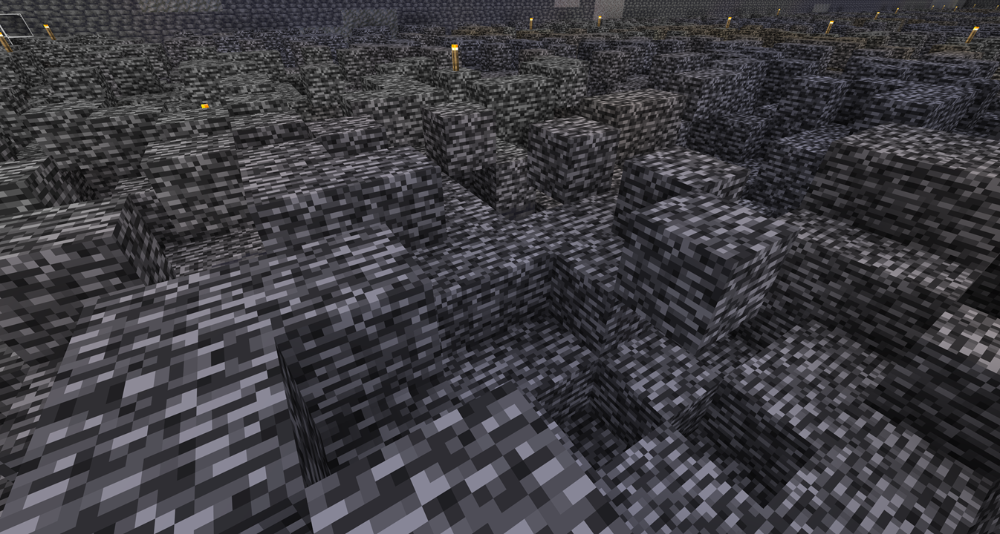
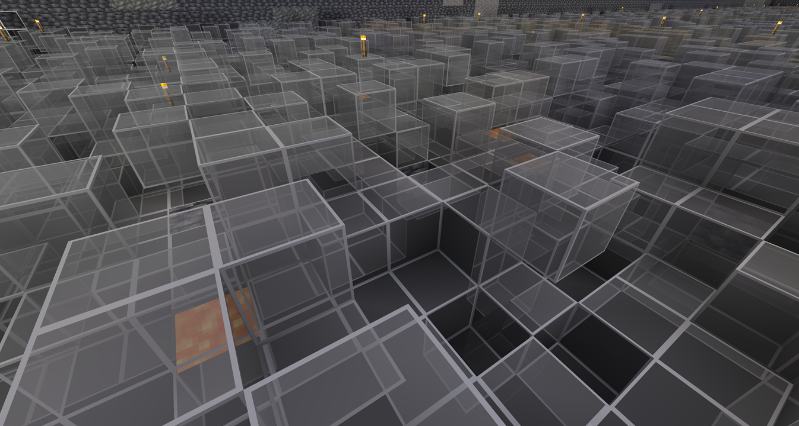
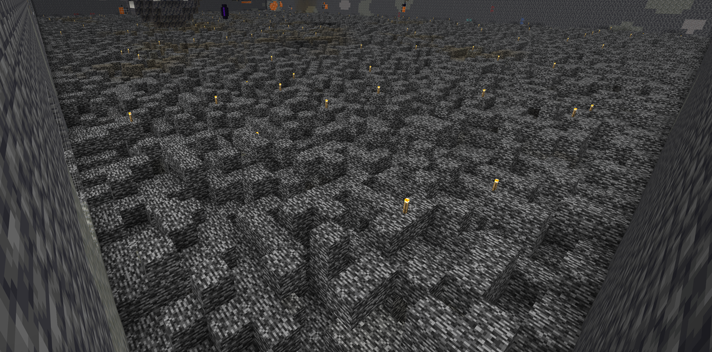
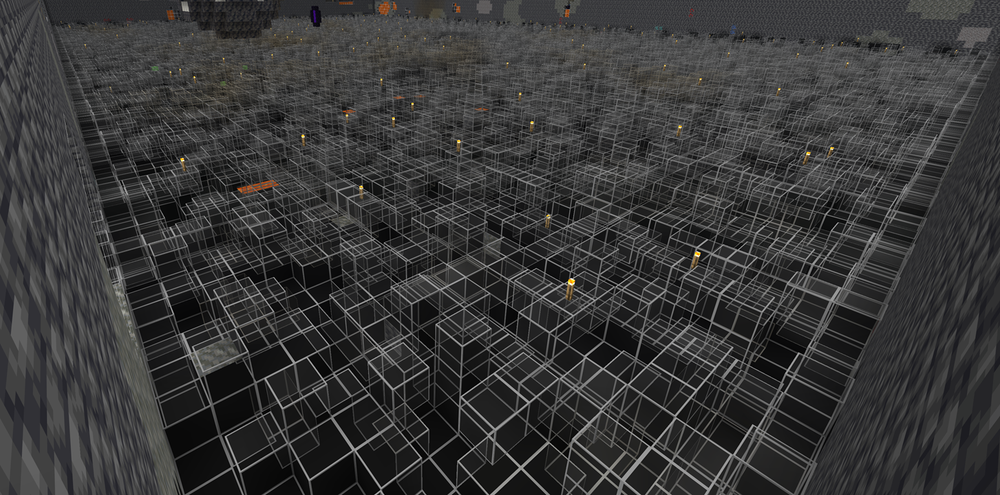

# Transparent Bedrock

A Minecraft resource pack that gives Bedrock blocks a more transparent appearance.

It makes it easier to spot blocks remaining in gaps in the bedrock.

岩盤のテクスチャを、より透明感のあるデザインに変更するマインクラフトのリソースパックです。

岩盤のスキマに残っているブロックを見つけやすくなります。

## Latest Release

1.0.0

## Java Edition

### Minecraft 26.1 / 26.1.1 / 26.1.2 / 26.2 or later

1. Download the resource pack from the `1.0.0` directory.

2. Place the downloaded file in your Minecraft `resourcepacks` folder.

On Windows, the default location is:

`C:\Users\<Username>\AppData\Roaming\.minecraft\resourcepacks`

## Bedrock Edition

1. Exit Minecraft.

2. Download `TransparentBedrock.mcpack` from the `1.0.0` directory.

3. Double-click or tap the downloaded file.

4. Minecraft will launch and display the message `Import started...`.

5. Wait until the message `Successfully imported 'Transparent Bedrock'` appears.

## Images

### Close-Up

### Overview

